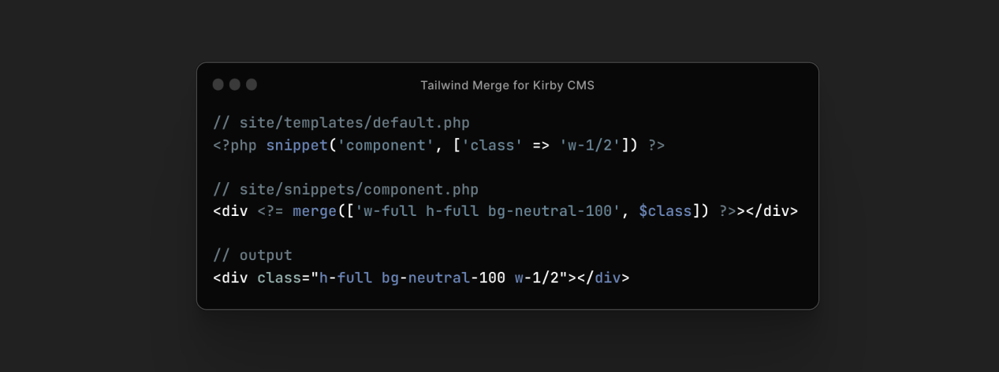

# Kirby Tailwind Merge

Intelligently merge Tailwind classes without style conflicts in your Kirby templates.



This plugin relies on [tailwind-merge-php by Sandro Gehri](https://github.com/gehrisandro/tailwind-merge-php) for merging classes and only adapts it to work in the "Kirby ecosystem". Any issues related to merging classes should probably reported over there.

## Installation

```
composer require tobimori/kirby-tailwind-merge
```

#### Manual installation

Download and copy this repository to `/site/plugins/kirby-tailwind-merge`, or apply this repository as Git submodule.

## Usage

This plugin provides two helper functions to use in your blueprints. Whether functions should be registered can be controlled in your `config.php`, see [Options](#options).

### `attr()`

This helper function works similar to the Kirby built-in `attr()` function and overwrites it to support Tailwind Merge behaviour for the `class` attribute.

You'll need to disable the built-in `attr()` helper at the top-most location in your `index.php` file - before Kirby is loaded.

```php
define("KIRBY_HELPER_ATTR", false);
```

#### Example

```php
// site/snippets/component.php
<div <?= attr(['class' => ['h-full w-full bg-neutral-100', $class], 'data-attr' => 'hello world!']) ?>>[...]</div>

// site/templates/default.php
<?php snippet('component', ['class' => 'w-1/2']) ?>

// output
<div class="h-full bg-neutral-100 w-1/2" data-attr="hello world!">[...]</div>
```

### `merge()`

`merge()` applies Tailwind Merge behaviour and outputs a class attribute.

#### Example

```php
// site/snippets/component.php
<div <?= merge('h-full w-full bg-neutral-100', $class) ?>>[...]</div>

// site/templates/default.php
<?php snippet('component', ['class' => 'w-1/2']) ?>

// output
<div class="h-full bg-neutral-100 w-1/2">[...]</div>
```

## Options

| Option          | Default | Description                            |
| --------------- | ------- | -------------------------------------- |
| `prefix`        | ``      | Set a prefix for your tailwind classes |
| `helpers.attr`  | `true`  | Register the `attr()` helper function  |
| `helpers.merge` | `true`  | Register the `merge()` helper function |

Options allow you to fine tune the behaviour of the plugin. You can set them in your `config.php` file:

```php
return [
    'tobimori.icon-field' => [
        'cache' => true,
        'folder' => 'assets/icon'
    ],
];
```

## Support

> This plugin is provided free of charge & published under the permissive MIT License. If you use it in a commercial project, please consider to [sponsor me on GitHub](https://github.com/sponsors/tobimori) to support further development and continued maintenance of my plugins.

## License

[MIT License](./LICENSE)
Copyright © 2023 Tobias Möritz
